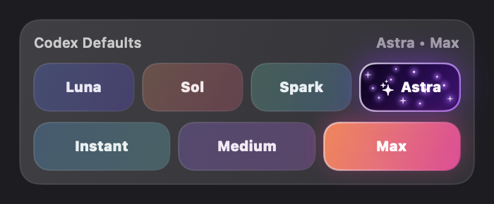

# Codex Usage for DockDoor Pro

A lightweight DockDoor Pro widget for keeping Codex usage, credit balance, recent chats, project activity, and local Codex defaults visible from the dock.

**Private installer:** `5.0.0` - model themes, Terra, Light reasoning, and Astra-only animated ring sparkles.

**Published update feed:** `4.1.0`. The 5.0.0 private installers are distributed locally; marketplace updates remain managed by DockDoor Pro.

**Marketplace Astra review:** [ejbills/dockdoorpro-widgets#24](https://github.com/ejbills/dockdoorpro-widgets/pull/24). The base read-only widget was merged in [#21](https://github.com/ejbills/dockdoorpro-widgets/pull/21).

The standalone build contains the complete tracker, freshness-aware account sync, model/reasoning defaults, card controls, and Sparkle companion. The marketplace companion is intentionally separate: it uses the `codex-usage` identifier and reads local Codex session telemetry or an optional `~/.codex/usage.json` override. It has no model-setting controls, installer, or Sparkle dependency.

**Canonical Discord discussion:** [Codex Usage Widget v3.0.0 (Repost)](https://discord.com/channels/1312172160931856464/1532985348374659092)




> **Distribution note:** The DMG contains a Developer ID-signed, Apple-notarized companion app. No `.command` file needs to be opened. Install the v4.1.0 DMG once on each Mac to migrate from the legacy script updater to Sparkle. See [update and signing details](docs/NOTARIZATION.md).

## Social Preview

Use this square cover image as the first Discord attachment when announcing the widget. The canonical Discord repost uses this file as its starter attachment and forum-card artwork:


## Highlights

- Usage countdown ring in the dock, with a built-in rainbow ring toggle.
- Rotating dock cards for account limits, credits, selected model, task count, and chat count, with a selectable primary card, adjustable interval, and hover pause.
- Panel view with credits, general usage, model-specific limits, task/chat totals, and recent Codex sessions.
- Scrollable recent-chat history covering up to 500 indexed sessions, with older titles loaded as rows appear.
- Freshness status, stale-data warnings, explicit refresh, and reset countdowns backed by timestamped account snapshots.
- Clickable recent chats that open Codex tasks through `codex://threads/<session-id>` when a session id is available.
- Local model and reasoning default controls for Luna, Sol, Spark, Astra, Instant, Medium, and Max.
- Astra (`gpt-6-astra`) has a dark-purple glowing starfield that animates when selected or hovered and respects Reduce Motion.
- A header update button opens Sparkle in the companion app; Sparkle is not loaded into DockDoor Pro.
- One-click Fast mode for switching new chats to Spark + Instant and restoring the previous defaults when disabled.
- DockDoor settings schema for session folder, usage state file, recent session count, budget window, rainbow mode, primary card, rotation interval, hover pause, and freshness status.

## Lightweight Design

Codex Usage is intentionally thin. It reads a small local snapshot, renders with native SwiftUI, and refreshes on a modest interval. The optional live-sync agent performs one short local Codex app-server request per minute and exits; there is no persistent helper daemon or widget-side network activity.

The compact dock card rotates on a configurable interval, session/usage snapshots refresh when their source files change, and the expanded panel updates countdown labels once per second without rescanning the filesystem. That keeps the widget visually alive while staying low on energy and memory use.

## Important Boundary

The model and reasoning buttons update local Codex defaults in `~/.codex/config.toml`. They apply to new local Codex work after the setting changes. They do not hot-swap the model or reasoning level of an already-running chat.

## Runtime Data

The widget reads Codex session files from `~/.codex/sessions` by default. The live-sync companion requests the signed-in account limits from Codex's local app-server and writes them atomically to `~/.codex/usage.json`, including an update timestamp and ISO reset timestamps. That file is authoritative because legacy session telemetry may describe a different or expired usage window. The widget invalidates its snapshot cache when the usage file, Codex config, history, or session files change. If the account file is unavailable or older than 15 minutes, the UI marks the data as stale and clearly labels any session-based fallback instead of presenting it as authoritative.

See [examples/usage.json](examples/usage.json) for the account-usage shape used by the current build.

## Easy Mac Installation

For another Mac, including a Mac mini, download the DMG from the [v4.1.0 release](https://github.com/appleforever11/codex-usage-dockdoor-widget/releases/tag/v4.1.0):

1. Open the v4.1.0 DMG.
2. Double-click `Install Codex Usage.app`.
3. The app moves itself into your user Applications folder. Click **Install Widget** for a fresh install; an older widget is updated automatically.
4. Wait for DockDoor Pro to restart, then hover over the Codex Usage dock widget.

The signed app installer does not open Terminal or require an administrator password. It preserves an existing widget as a recoverable backup, retains the marketplace identifier and dock placement, installs the universal Apple Silicon/Intel bundle, enables live account synchronization, and verifies the first snapshot. DockDoor Pro must be installed and activated on the destination Mac, and Codex or ChatGPT must be signed in for account usage data.

## Automatic Updates

Click the **Check for widget updates** icon in the widget header, or **Check for Updates** in `~/Applications/Install Codex Usage.app`.

- Sparkle 2.9.6 checks a signed appcast and verifies Ed25519 update signatures.
- The companion downloads the signed/notarized application archive, asks before installing, and relaunches.
- On relaunch, a newer bundled widget is staged and signature-checked before DockDoor Pro quits.
- Existing widget filenames and dock placement are retained; backups are kept in `~/Library/Application Support/DockDoorPro/WidgetInstallerBackups/` and restored if installation fails.
- DockDoor Pro restarts to load the update. The companion closes when you dismiss it.
- A login/six-hour LaunchAgent performs short background checks and exits after each completed check. An available update can show Sparkle's update prompt.

**One-time migration:** Users on v4.0.0 or earlier must open the v4.1.0 DMG once. Installing only the widget bundle cannot install Sparkle. The marketplace edition continues to use DockDoor Pro's own update system.

Release tags trigger `.github/workflows/release.yml`, which builds universal packages, notarizes and staples the app and DMG, signs the appcast, and publishes immutable release assets. Already-published releases are skipped so their signatures and downloads cannot be silently replaced.

Build fresh DMG and ZIP transfer packages with the signed installer app:

```bash
Scripts/build-mac-mini-installer.sh
```

## Live Account Sync

Install the optional one-shot sync agent after installing the widget:

```bash
Scripts/install-usage-sync.sh
```

It refreshes `~/.codex/usage.json` from the official local `account/rateLimits/read` RPC every 60 seconds. Each invocation exits after the snapshot is written, and a bounded retry handles occasional slow app-server startup without replacing the last valid data.

Logs are written to `~/Library/Logs/CodexUsageWidget/`. To remove the agent:

```bash
Scripts/uninstall-usage-sync.sh
```

## Settings

DockDoor Pro exposes these widget settings:

| Setting | Default | Purpose |
| --- | --- | --- |
| Codex Sessions Folder | `~/.codex/sessions` | Where recent Codex task/session JSONL files are scanned. |
| Recent Session Count | `5` | Number of recent chats shown in the panel. |
| Usage Budget (M tokens) | `200` | Fallback rolling-window budget when account usage data is unavailable. |
| Usage Window Hours | `5` | Fallback rolling-window length. |
| Usage State File | `~/.codex/usage.json` | Authoritative current-account snapshot produced by the optional live-sync agent; session telemetry is the fallback. |
| Rainbow Usage Ring | `On` | Uses the rainbow/glow usage ring instead of a single-color ring. |
| Primary Dock Card | `Auto` | Keep the dock card rotating or pin it to Usage, Model, Tasks, Chats, or Credits. |
| Card Rotation Seconds | `4` | Rotation interval from 2 to 12 seconds. |
| Pause Rotation on Hover | `On` | Freeze the compact card while it is being inspected. |
| Show Data Freshness | `On` | Show the source and last-update status in the expanded panel. |

The panel also includes a small palette button in the header. That button toggles the same `Rainbow Usage Ring` preference without needing to open DockDoor Pro settings.

## Build

From this folder:

```bash
bash Scripts/build-widgets.sh Widgets/CodexProjectTracker
```

Build output:

```text
build/CodexProjectTracker.bundle
build/CodexProjectTracker.bundle.zip
```

## Install Locally

Copy the built bundle into DockDoor Pro's widget folder:

```bash
mkdir -p "$HOME/Library/Application Support/DockDoorPro/Widgets"
cp -R build/CodexProjectTracker.bundle "$HOME/Library/Application Support/DockDoorPro/Widgets/"
```

Restart DockDoor Pro after replacing an installed bundle.

## Marketplace Prep

This repository is the full-featured release and documentation home for marketplace companion PR [#21](https://github.com/ejbills/dockdoorpro-widgets/pull/21). The companion submission is a separate `codex-usage` widget with read-only usage display; it does not replace the original `codex-project-tracker` identifier. Discord review and future community updates continue in the [canonical v3.0.0 repost](https://discord.com/channels/1312172160931856464/1532985348374659092); the older forum thread is superseded because its starter message was deleted and Discord cannot restore it.

Marketplace companion checklist:

- The original tracker remains under `codex-project-tracker`.
- The separate marketplace widget uses `codex-usage` and reads Codex session telemetry or an optional `~/.codex/usage.json` override.
- The marketplace widget contains only `widget.json` and Swift source files.
- The full installer, updater, live-sync helper, screenshots, and release notes remain standalone assets in this repository.
- Use [docs/MARKETPLACE_SUBMISSION.md](docs/MARKETPLACE_SUBMISSION.md) for the boundary and review checklist.
