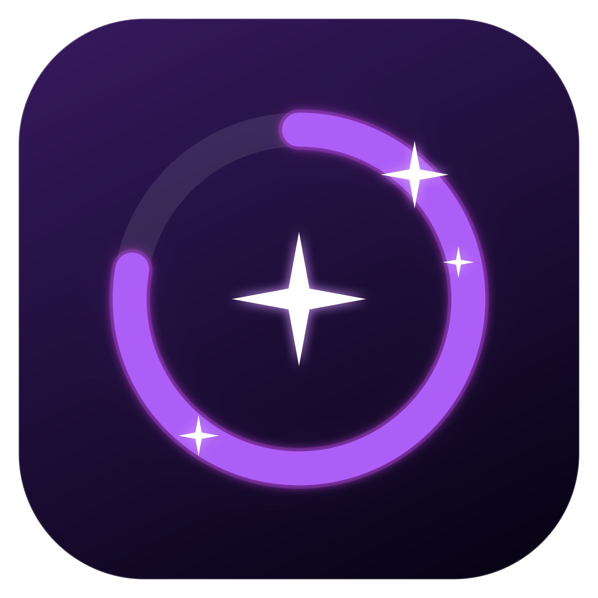

# Codex Usage for DockDoor Pro

A lightweight DockDoor Pro widget for keeping Codex usage, credit balance, recent chats, project activity, and local Codex defaults visible from the dock.

**Latest release:** [6.0.4](https://github.com/appleforever11/codex-usage-dockdoor-widget/releases/tag/v6.0.4) — restores live account refresh after the ChatGPT/Codex macOS app update and keeps local Window/Today token totals independent from account quota snapshots.

**Previous 5.x release:** [5.0.5](https://github.com/appleforever11/codex-usage-dockdoor-widget/releases/tag/v5.0.5) — fixes current-session model/reasoning attribution in local token activity.

**Marketplace 6.0 dashboard:** merged in [ejbills/dockdoorpro-widgets#27](https://github.com/ejbills/dockdoorpro-widgets/pull/27), including ejbills' persistent card layout, move-menu controls, shared log discovery, readable light-mode values, and seven-day defaults. The GPT-6 follow-up builds on that merged version.

The standalone build contains the complete tracker, freshness-aware account sync, model/reasoning defaults, card controls, and Sparkle companion. The marketplace companion is intentionally separate: it uses the `codex-usage` identifier and reads local Codex session telemetry or an optional `~/.codex/usage.json` override. It has no model-setting controls, installer, or Sparkle dependency.

The companion build includes bounded local token telemetry. It reports observed burn rates, context-window usage, and per-model/reasoning totals from Codex session events. The Token activity panel is collapsible so the compact summary stays visible without crowding the rest of the widget. Token data stays on the Mac; account percentage limits remain a separate authoritative surface.

**Canonical Discord discussion:** [Codex Usage Widget v3.0.0 (Repost)](https://discord.com/channels/1312172160931856464/1532985348374659092)

## 6.0 visual refresh

The 6.0 companion build keeps the full dashboard expressive while both the standard compact dock view and the optional Reflective Shelf beta use a genuinely transparent root. DockDoor Pro supplies the shelf material and reflection; the widget contributes only the themed usage ring, its breathing glow, animated sparkles, model-first labels, and readable neutral text. There is no colored capsule, edge border, or backing card behind the dock content.

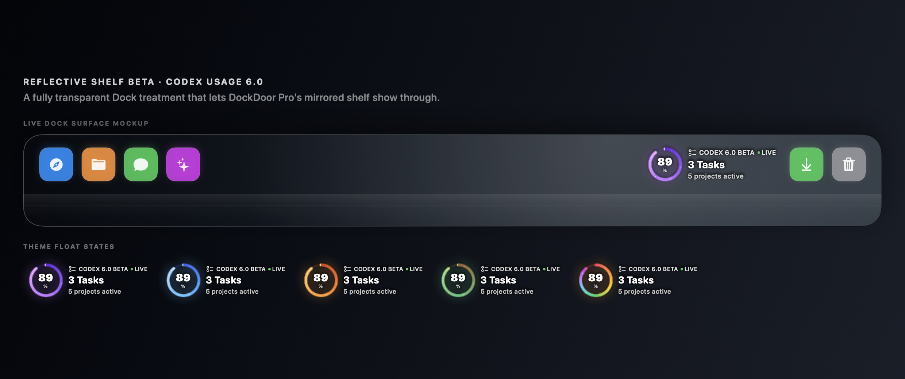

### Updated v6 screenshots

The following previews are rendered from the current native SwiftUI 6.0.1 interface with sample data. The dock gallery covers compact, extended horizontal, and extended vertical sizing; the page captures show the refreshed themed dashboard surface.

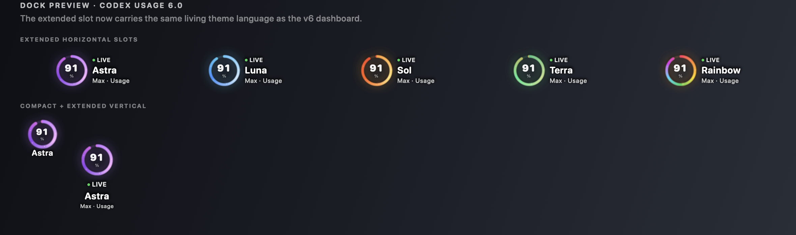

The gallery changes the **page theme**; the sample’s selected model remains Astra in every capture.

| Astra | Luna | Sol |
| --- | --- | --- |
| 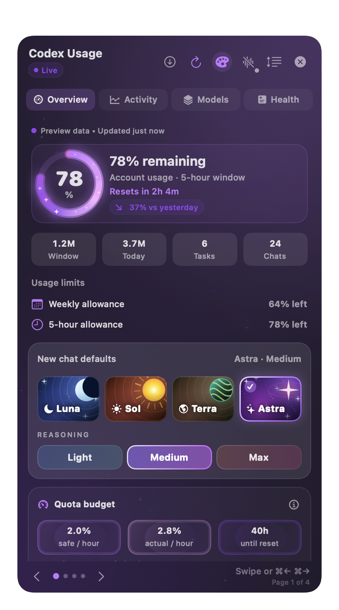 | 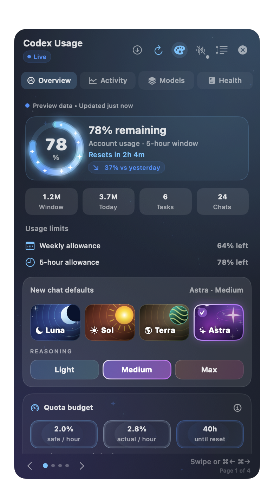 | 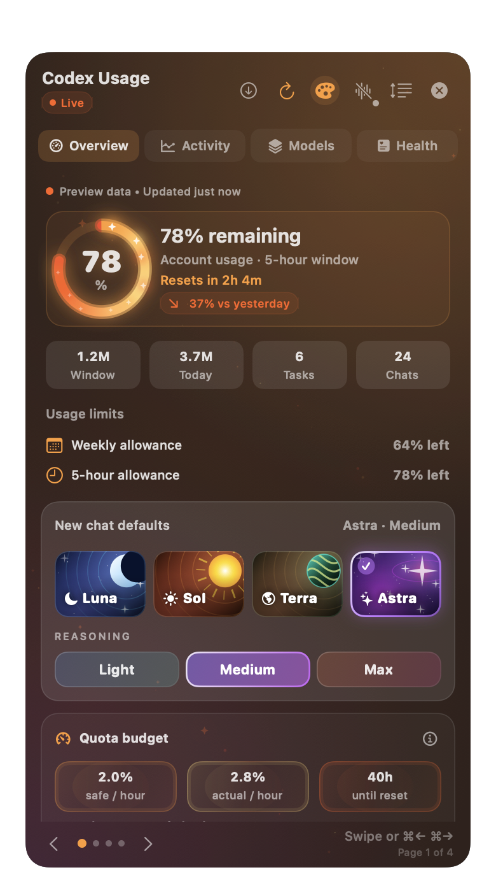 |

| Terra | Rainbow |
| --- | --- |
| 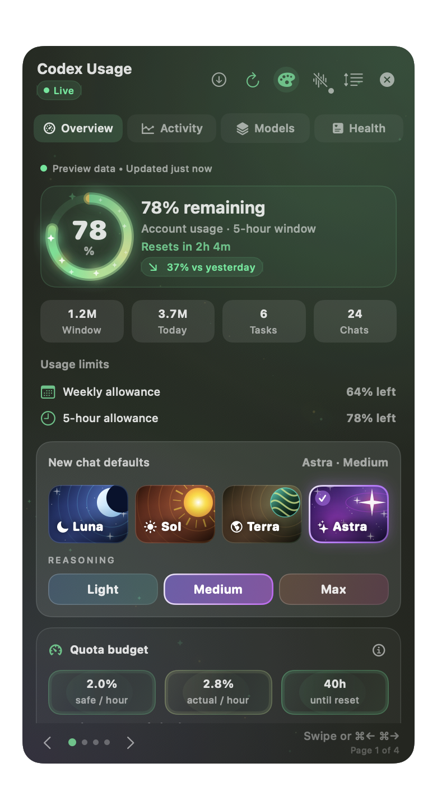 | 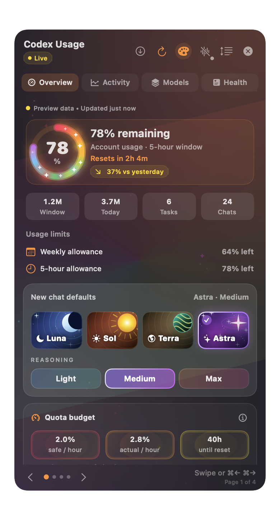 |

## 🚀 6.0 release highlights

This public update is for the companion edition and its full-featured `codex-project-tracker` widget. The marketplace `codex-usage` variant is intentionally unchanged and remains on DockDoor Pro's separate read-only update path.

### ✨ New widget preview options

| Preview option | What it demonstrates |
| --- | --- |
| 🧭 **Overview** | Quota, quota pace, live burn, context health, quota budget, session pulse, and context runway cards. |
| 📈 **Activity** | Daily and hourly activity, project heatmap, turn timeline, streaks and goals, and cost estimate cards with Today, 7 days, and 30 days filters. |
| 🧠 **Models** | Model mix, model scorecard, efficiency, project mix, and session health with model filtering. |
| 🩺 **Health** | Official activity, reliability, data health, workspace health, recent chats, and new-chat model/reasoning controls. |
| 🎨 **Theme gallery** | Independent Astra, Luna, Sol, Terra, and Rainbow page themes, with each theme carried through every related ring, bar, chart, surface, glow, and sparkle. |
| 🫧 **Dock sizing** | One transparent widget preview adapts between compact, extended horizontal, and extended vertical layouts. |
| 🪞 **Reflective Shelf beta** | Edge-free transparent dock content that lets DockDoor Pro provide the shelf material and reflection while the widget contributes its living ring and readable model-first labels. |
| 🖱️ **Navigation** | Two-finger trackpad swipes, previous/next controls, page dots, and keyboard shortcuts (`⌘←` / `⌘→`). |
| 🧲 **Interaction polish** | Optional haptic feedback for page/model actions, drag-to-reorder cards, hover detail affordances, and Reduce Motion support. |

### 🎉 Detailed 6.0 changes

- 🧭 **A dashboard that feels like a dashboard:** the panel is now organized into four swipeable pages instead of one crowded stream. Page-specific themes, page dots, keyboard controls, and animated transitions make the current context obvious.
- 📊 **More useful data at a glance:** account quota and reset timing remain authoritative, while local token telemetry adds burn rate, context-window health, model/reasoning attribution, project activity, cost estimates, reliability, and workspace health.
- 🪄 **Living theme language:** breathing ambient backgrounds, themed progress rings, coordinated metric bars, chart columns, glowing card edges, and faint floating stars stay synchronized across Astra, Luna, Sol, Terra, and Rainbow. Reduce Motion keeps a calm static rendering when requested.
- 🖱️ **Trackpad-first navigation:** two-finger drags on the trackpad move between pages, with visible swipe progress and keyboard/arrow controls as dependable alternatives.
- 🧲 **Haptics you can see and control:** the model controls expose the haptic state directly, with feedback for meaningful page and model changes rather than repeated taps on an already-selected option.
- 🧩 **Cards that are yours:** enter arrangement mode, drag cards into a custom order, open a focused detail sheet, and choose compact, standard, or spacious density without losing the rounded section treatment.
- 🫧 **DockDoor Pro preview refresh:** compact, horizontal, and vertical previews share one visual system, foreground the active model name (Luna, Sol, Terra, or Astra), keep supporting text legible, and remove the old colored capsule/border from the transparent Reflective Shelf beta treatment.
- 🔒 **Local-first by design:** observed token events, cache state, session health, and workspace checks stay on the Mac. Account percentages continue to come from the local Codex app-server snapshot and are labeled separately from derived telemetry.

The complete release notes are in [docs/RELEASE-6.0.3.md](docs/RELEASE-6.0.3.md). The public Sparkle feed is generated and signed by the tag-driven release workflow after the universal app, widget, and notarized installer pass validation. Earlier screenshots below retain their original release labels; the current interface uses Luna-6 and Sol-6.

## New design · 5.0.4

The screenshots below show the 5.0.4 design, rendered from the native SwiftUI interface with sample data.

Astra leads with a deep-purple glow and exclusive animated sparkles on the usage ring. Custom Luna, Sol, Terra, and Astra buttons sit alongside Light, Medium, and Max reasoning controls.

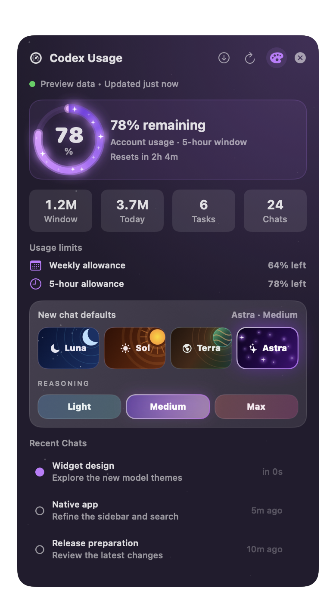

### Model themes

Choose a theme independently of your selected model: Luna blue, Sol amber, Terra earth and green, Astra purple, or Rainbow.

| Luna | Sol | Terra |
| --- | --- | --- |
| 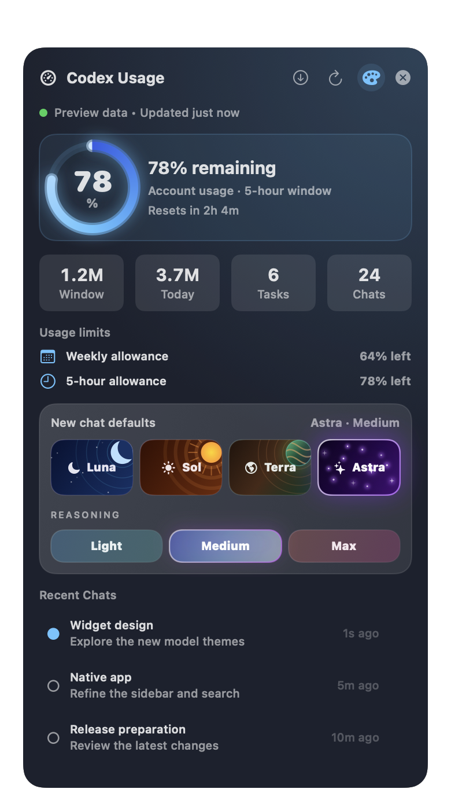 | 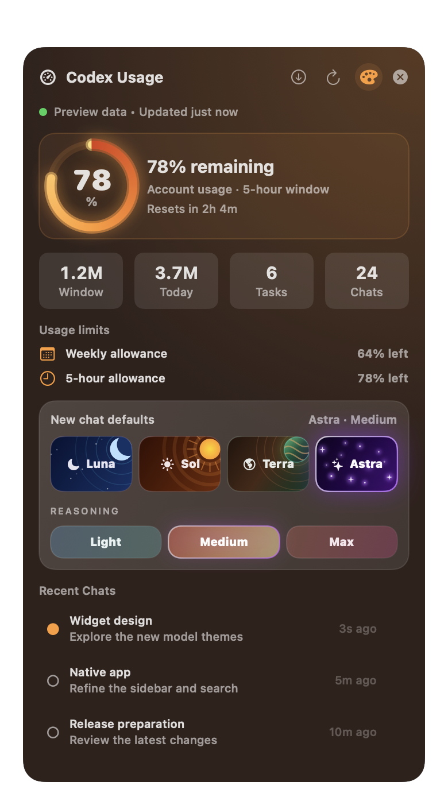 | 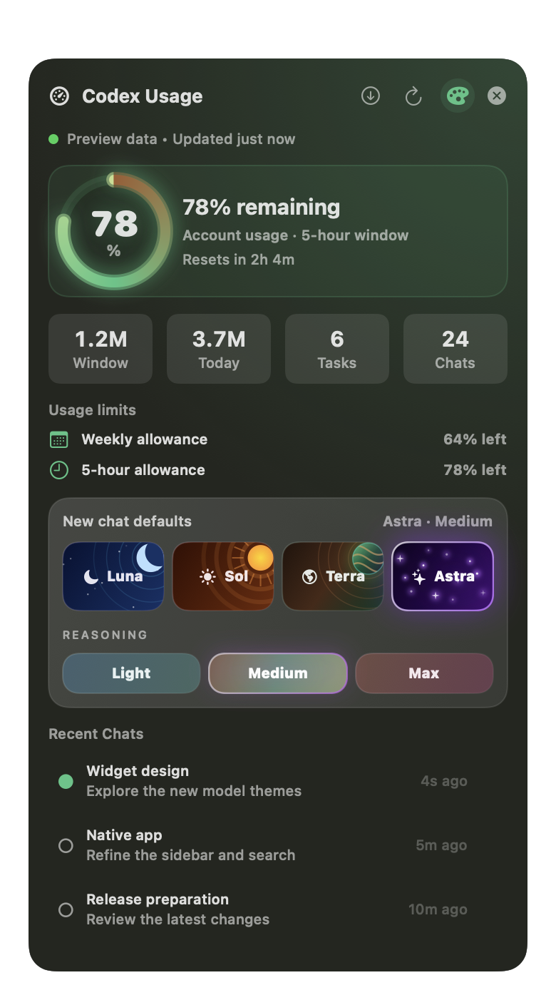 |

### Appearance controls

The palette button opens theme selection, a 20–100% background opacity slider, and a Frosted glass toggle. Labels and controls stay readable as the background becomes more transparent.

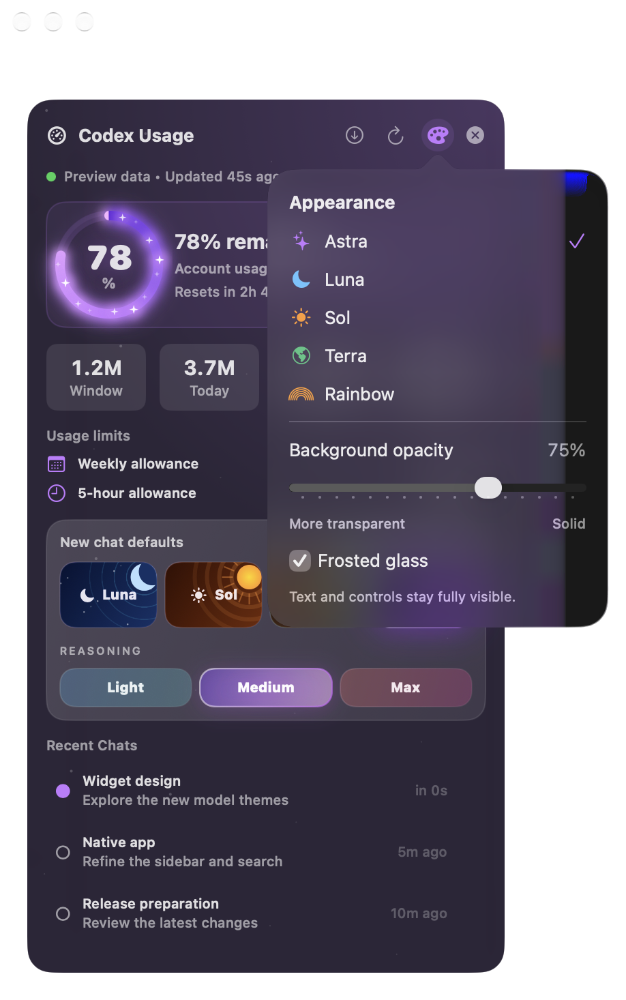

### Custom companion icon

The private companion and its Sparkle update dialog now use our custom Astra usage-ring icon.


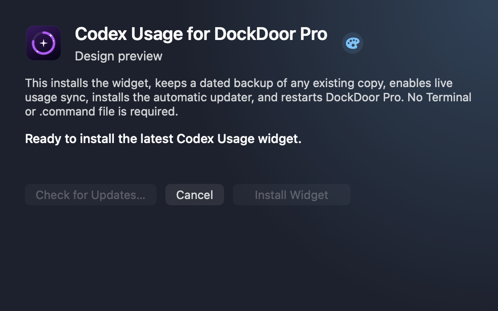

## Current release features

The highlights and installation instructions below describe the currently published build. The marketplace edition uses DockDoor Pro's own update path; Sparkle belongs to the private companion.

## Highlights

- Usage countdown ring in the dock, with Astra, Luna-6, Sol-6, Terra, and Rainbow themes.
- Rotating dock cards for account limits, credits, selected model, task count, and chat count, with a selectable primary card, adjustable interval, and hover pause.
- Panel view with credits, general usage, model-specific limits, task/chat totals, and recent Codex sessions.
- Private local token telemetry with a 60-second burn chart, context percentage, freshness state, and per-model/reasoning breakdown.
- Scrollable recent-chat history covering up to 500 indexed sessions, with older titles loaded as rows appear.
- Freshness status, stale-data warnings, explicit refresh, and reset countdowns backed by timestamped account snapshots.
- Clickable recent chats that open Codex tasks through `codex://threads/<session-id>` when a session id is available.
- Local model and reasoning default controls for Luna-6, Sol-6, Terra, Astra, Light, Medium, and Max. Choosing Luna-6 or Sol-6 writes the GPT-6 ID for new chats; existing chats and nested profiles are preserved.
- Astra (`gpt-6-astra`) has a dark-purple glowing starfield that animates when selected or hovered and respects Reduce Motion.
- A header update button opens Sparkle in the companion app; Sparkle is not loaded into DockDoor Pro.
- DockDoor settings schema for session folder, usage state file, recent session count, budget window, rainbow mode, primary card, rotation interval, hover pause, and freshness status.

## Lightweight Design

Codex Usage is intentionally thin. It reads a small local snapshot, renders with native SwiftUI, and refreshes on a modest interval. The optional live-sync agent performs one short local Codex app-server request per minute and exits; there is no persistent helper daemon or widget-side network activity.

The compact dock card rotates on a configurable interval, session/usage snapshots refresh when their source files change, and the expanded panel updates countdown labels every 15 seconds without rescanning the filesystem. That keeps the widget visually alive while staying low on energy and memory use.

## Important Boundary

The model and reasoning buttons update local Codex defaults in `~/.codex/config.toml`. They apply to new local Codex work after the setting changes. They do not hot-swap the model or reasoning level of an already-running chat.

## Runtime Data

The widget reads Codex session files from `~/.codex/sessions` by default. The live-sync companion requests the signed-in account limits from Codex's local app-server and writes them atomically to `~/.codex/usage.json`, including an update timestamp and ISO reset timestamps. That file is authoritative because legacy session telemetry may describe a different or expired usage window. The widget invalidates its snapshot cache when the usage file, Codex config, history, or session files change. If the account file is unavailable or older than 15 minutes, the UI marks the data as stale and clearly labels any session-based fallback instead of presenting it as authoritative.

See [examples/usage.json](examples/usage.json) for the account-usage shape used by the current build.

## Easy Mac Installation

For another Mac, including a Mac mini, download the DMG from the [latest release](https://github.com/appleforever11/codex-usage-dockdoor-widget/releases/latest):

1. Open the downloaded DMG.
2. Double-click `Install Codex Usage.app`.
3. The app moves itself into your user Applications folder. Click **Install Widget** for a fresh install; an older widget is updated automatically.
4. Wait for DockDoor Pro to restart, then hover over the Codex Usage dock widget.

The signed app installer does not open Terminal or require an administrator password. It preserves an existing widget as a recoverable backup, retains the marketplace identifier and dock placement, installs the universal Apple Silicon/Intel bundle, enables live account synchronization, and verifies the first snapshot. DockDoor Pro must be installed and activated on the destination Mac, and Codex or ChatGPT must be signed in for account usage data.

## Automatic Updates

Click the **Check for widget updates** icon in the widget header, or **Check for Updates** in `~/Applications/Install Codex Usage.app`.

- Sparkle 2.9.6 checks a signed appcast and verifies Ed25519 update signatures.
- The companion downloads the signed/notarized application archive, asks before installing, and relaunches.
- On relaunch, a newer bundled widget is staged and signature-checked before DockDoor Pro quits.
- Existing widget filenames and dock placement are retained; backups are kept in `~/Library/Application Support/DockDoorPro/WidgetInstallerBackups/` and restored if installation fails.
- DockDoor Pro restarts to load the update. The companion closes when you dismiss it.
- A login/six-hour LaunchAgent performs short background checks and exits after each completed check. An available update can show Sparkle's update prompt.

**One-time migration:** Users on v4.0.0 or earlier must open the v4.1.0 DMG once. Installing only the widget bundle cannot install Sparkle. The marketplace edition continues to use DockDoor Pro's own update system.

Release tags trigger `.github/workflows/release.yml`, which builds universal packages, notarizes and staples the app and DMG, signs the appcast, and publishes immutable release assets. Already-published releases are skipped so their signatures and downloads cannot be silently replaced.

Build fresh DMG and ZIP transfer packages with the signed installer app:

```bash
Scripts/build-mac-mini-installer.sh
```

## Live Account Sync

Install the optional one-shot sync agent after installing the widget:

```bash
Scripts/install-usage-sync.sh
```

It discovers the bundled Codex CLI in current Codex and ChatGPT desktop apps (including `Contents/Resources/codex-cli/bin/codex`) and refreshes `~/.codex/usage.json` from the official local `account/rateLimits/read` RPC every 60 seconds. Each invocation exits after the snapshot is written, and a bounded retry handles occasional slow app-server startup without replacing the last valid data.

Logs are written to `~/Library/Logs/CodexUsageWidget/`. To remove the agent:

```bash
Scripts/uninstall-usage-sync.sh
```

## Settings

DockDoor Pro exposes these widget settings:

| Setting | Default | Purpose |
| --- | --- | --- |
| Codex Sessions Folder | `~/.codex/sessions` | Where recent Codex task/session JSONL files are scanned. |
| Recent Session Count | `5` | Number of recent chats shown in the panel. |
| Usage Budget (M tokens) | `200` | Fallback rolling-window budget when account usage data is unavailable. |
| Usage Window Hours | `5` | Fallback rolling-window length. |
| Usage State File | `~/.codex/usage.json` | Authoritative current-account snapshot produced by the optional live-sync agent; session telemetry is the fallback. |
| Rainbow Usage Ring | `On` | Uses the rainbow/glow usage ring instead of a single-color ring. |
| Primary Dock Card | `Auto` | Keep the dock card rotating or pin it to Usage, Model, Burn, Tasks, Chats, or Credits. |
| Card Rotation Seconds | `4` | Rotation interval from 2 to 12 seconds. |
| Pause Rotation on Hover | `On` | Freeze the compact card while it is being inspected. |
| Show Data Freshness | `On` | Show the source and last-update status in the expanded panel. |
| Show Local Token Activity | `On` | Show observed local token burn and model/reasoning telemetry in the expanded panel. |

The panel also includes a small palette button in the header. That button opens model themes, background opacity, and Frosted glass controls.

## Build

From this folder:

```bash
bash Scripts/build-widgets.sh Widgets/CodexProjectTracker
```

Build output:

```text
build/CodexProjectTracker.bundle
build/CodexProjectTracker.bundle.zip
```

## Install Locally

Copy the built bundle into DockDoor Pro's widget folder:

```bash
mkdir -p "$HOME/Library/Application Support/DockDoorPro/Widgets"
cp -R build/CodexProjectTracker.bundle "$HOME/Library/Application Support/DockDoorPro/Widgets/"
```

Restart DockDoor Pro after replacing an installed bundle.

## Marketplace Prep

This repository is the full-featured release and documentation home for marketplace companion PR [#21](https://github.com/ejbills/dockdoorpro-widgets/pull/21). The companion submission is a separate `codex-usage` widget with read-only usage display; it does not replace the original `codex-project-tracker` identifier. Discord review and future community updates continue in the [canonical v3.0.0 repost](https://discord.com/channels/1312172160931856464/1532985348374659092); the older forum thread is superseded because its starter message was deleted and Discord cannot restore it.

Marketplace companion checklist:

- The original tracker remains under `codex-project-tracker`.
- The separate marketplace widget uses `codex-usage` and reads Codex session telemetry or an optional `~/.codex/usage.json` override.
- The marketplace widget contains only `widget.json` and Swift source files.
- The full installer, updater, live-sync helper, screenshots, and release notes remain standalone assets in this repository.
- Use [docs/MARKETPLACE_SUBMISSION.md](docs/MARKETPLACE_SUBMISSION.md) for the boundary and review checklist.
