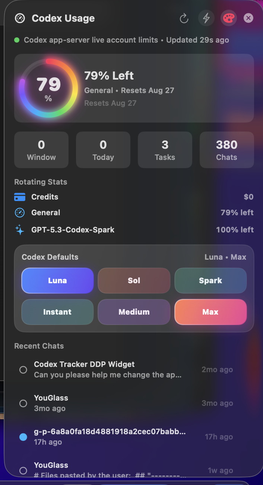
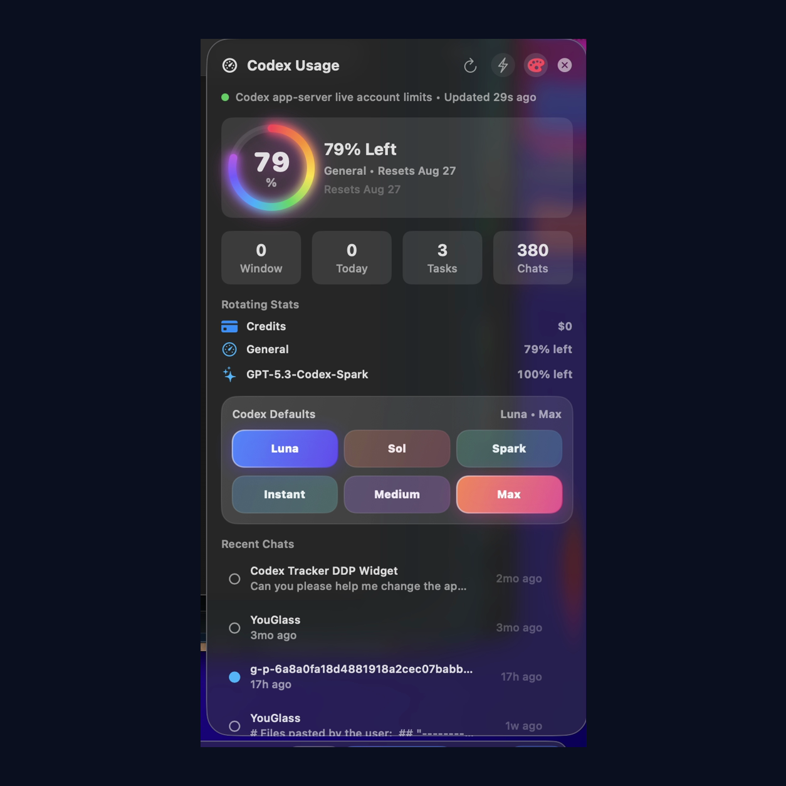

# Codex Usage for DockDoor Pro

A lightweight DockDoor Pro widget for keeping Codex usage, credit balance, recent chats, project activity, and local Codex defaults visible from the dock.

**Current release:** `3.2.0`

**Marketplace PR:** [ejbills/dockdoorpro-widgets#20](https://github.com/ejbills/dockdoorpro-widgets/pull/20)

**Canonical Discord discussion:** [Codex Usage Widget v3.0.0 (Repost)](https://discord.com/channels/1312172160931856464/1532985348374659092)



## Social Preview

Use this square cover image as the first Discord attachment when announcing the widget. The canonical Discord repost uses this file as its starter attachment and forum-card artwork:



## Highlights

- Usage countdown ring in the dock, with a built-in rainbow ring toggle.
- Rotating dock cards for account limits, selected model, task count, and chat count.
- Panel view with credits, general usage, model-specific limits, task/chat totals, and recent Codex sessions.
- Clickable recent chats that open Codex tasks through `codex://threads/<session-id>` when a session id is available.
- Local model and reasoning default controls for Luna, Sol, Spark, Instant, Medium, and Max.
- One-click Fast mode for switching new chats to Spark + Instant and restoring the previous defaults when disabled.
- DockDoor settings schema for session folder, usage state file, recent session count, budget window, and rainbow mode.

## Lightweight Design

Codex Usage is intentionally thin. It reads a small local snapshot, renders with native SwiftUI, and refreshes on a modest interval. The optional live-sync agent performs one short local Codex app-server request per minute and exits; there is no persistent helper daemon or widget-side network activity.

The compact dock card rotates every few seconds, session/usage snapshots refresh periodically, and the expanded panel uses a slower label refresh because the data does not require second-by-second updates. That keeps the widget visually alive while staying low on energy and memory use.

## Important Boundary

The model and reasoning buttons update local Codex defaults in `~/.codex/config.toml`. They apply to new local Codex work after the setting changes. They do not hot-swap the model or reasoning level of an already-running chat.

## Runtime Data

The widget reads Codex session files from `~/.codex/sessions` by default. The live-sync companion requests the signed-in account limits from Codex's local app-server and writes them atomically to `~/.codex/usage.json`. That file is authoritative because legacy session telemetry may describe a different or expired usage window. If the file is unavailable or invalid, the widget falls back to the newest General and model-specific `rate_limits` events in session telemetry, then to local token-window estimates.

See [examples/usage.json](examples/usage.json) for the account-usage shape used by the current build.

## Easy Mac Installation

For another Mac, including a Mac mini, download the DMG from the [v3.2.0 release](https://github.com/appleforever11/codex-usage-dockdoor-widget/releases/tag/v3.2.0):

1. Open `Codex Usage for DockDoor Pro v3.2.0.dmg`.
2. Double-click `Install Codex Usage.command`.
3. Choose **Open** if macOS asks for confirmation.
4. Wait for DockDoor Pro to restart, then hover over the Codex Usage dock widget.

The installer requires no administrator password. It preserves an existing widget as a recoverable backup, retains the marketplace identifier and dock placement, installs the universal Apple Silicon/Intel bundle, enables live account synchronization, and verifies the first snapshot. DockDoor Pro must be installed and activated on the destination Mac, and Codex or ChatGPT must be signed in for account usage data.

## Automatic Updates

The Mac installer adds a lightweight updater that runs at login and every six hours. It checks the latest stable GitHub release and exits immediately when the installed version is current. For an available update, it:

- Compares semantic versions and never downgrades a newer local build.
- Downloads only `CodexProjectTracker.bundle.zip` from the official release.
- Requires the archive SHA-256 to match GitHub's published asset digest.
- Validates the property list and both `arm64` and `x86_64` architectures before touching the installed widget.
- Stages the complete replacement before stopping DockDoor Pro.
- Preserves the existing hashed bundle name, marketplace identifier, and dock placement.
- Saves the previous bundle under `~/Library/Application Support/DockDoorPro/WidgetUpdaterBackups/`.
- Restarts DockDoor Pro only when it was already running.

Updater logs are stored at `~/Library/Logs/CodexUsageWidget/updater.log`. Run an immediate check with:

```bash
"$HOME/Library/Application Support/CodexUsageWidget/update-codex-widget.sh"
```

Release tags trigger `.github/workflows/release.yml`, which verifies `VERSION`, builds the universal widget and Mac installers, and creates or refreshes the GitHub release assets automatically.

Build fresh DMG and ZIP transfer packages with:

```bash
Scripts/build-mac-mini-installer.sh
```

## Live Account Sync

Install the optional one-shot sync agent after installing the widget:

```bash
Scripts/install-usage-sync.sh
```

It refreshes `~/.codex/usage.json` from the official local `account/rateLimits/read` RPC every 60 seconds. Each invocation exits after the snapshot is written, and a bounded retry handles occasional slow app-server startup without replacing the last valid data.

Logs are written to `~/Library/Logs/CodexUsageWidget/`. To remove the agent:

```bash
Scripts/uninstall-usage-sync.sh
```

## Settings

DockDoor Pro exposes these widget settings:

| Setting | Default | Purpose |
| --- | --- | --- |
| Codex Sessions Folder | `~/.codex/sessions` | Where recent Codex task/session JSONL files are scanned. |
| Recent Session Count | `5` | Number of recent chats shown in the panel. |
| Usage Budget (M tokens) | `200` | Fallback rolling-window budget when account usage data is unavailable. |
| Usage Window Hours | `5` | Fallback rolling-window length. |
| Usage State File | `~/.codex/usage.json` | Authoritative current-account snapshot produced by the optional live-sync agent; session telemetry is the fallback. |
| Rainbow Usage Ring | `On` | Uses the rainbow/glow usage ring instead of a single-color ring. |

The panel also includes a small palette button in the header. That button toggles the same `Rainbow Usage Ring` preference without needing to open DockDoor Pro settings.

## Build

From this folder:

```bash
bash Scripts/build-widgets.sh Widgets/CodexProjectTracker
```

Build output:

```text
Build/CodexProjectTracker.bundle
Build/CodexProjectTracker.bundle.zip
```

## Install Locally

Copy the built bundle into DockDoor Pro's widget folder:

```bash
mkdir -p "$HOME/Library/Application Support/DockDoorPro/Widgets"
cp -R Build/CodexProjectTracker.bundle "$HOME/Library/Application Support/DockDoorPro/Widgets/"
```

Restart DockDoor Pro after replacing an installed bundle.

## Marketplace Prep

This repository is the review and documentation home for marketplace PR [#20](https://github.com/ejbills/dockdoorpro-widgets/pull/20). Discord review and future community updates continue in the [canonical v3.0.0 repost](https://discord.com/channels/1312172160931856464/1532985348374659092); the older forum thread is superseded because its starter message was deleted and Discord cannot restore it.

Before opening the marketplace PR:

- Confirm the widget builds with the current DockDoor Pro widget SDK.
- Confirm the screenshot in `screenshots/codex-usage-panel.png` matches the current UI.
- Confirm `widget.json` uses the marketplace-ready name, description, icon, and principal class.
- Add any new real-world screenshots to `screenshots/`.
- Use [docs/MARKETPLACE_SUBMISSION.md](docs/MARKETPLACE_SUBMISSION.md) as the submission checklist.
